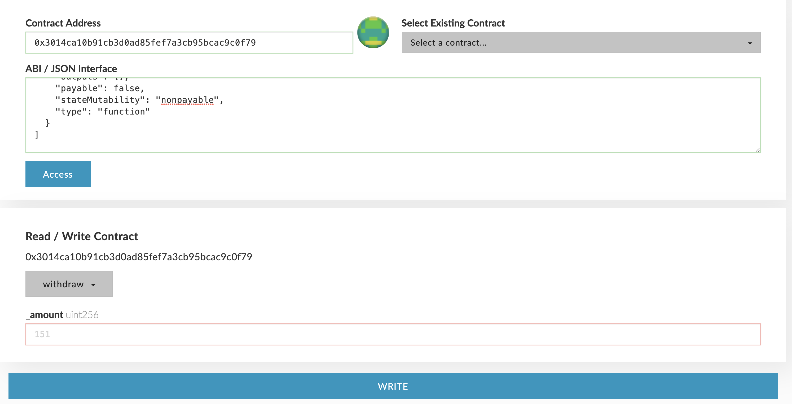

# Stake, Delegate and Withdraw

The basic requirement to become a MediaBlock Coin chain validator is to have a stake amount of at least 100,000 MediaBlock Coin tokens. The stake amount is the sum of staked and delegated MediaBlock Coin tokens of the address. This guide walks trough the process of using MEW \(MyEtherWallet.com\) in the process of using MediaBlock Coin network.


**Roadmap** - Those functionalities will be built into our Studio and will not require any technical knowledge in the future.


## Stake

There are two options to stake \(both should be called from the address which would be the validator\)

1. Send MediaBlock Coin tokens to the [consensus contract](https://MediaBlockscan.io/address/0x07C53925485179505e1189021c8f794A2A16da54) - 0x07C53925485179505e1189021c8f794A2A16da54 on the MediaBlock network.
2. Call the \`stake\` function on the [consensus contract](https://MediaBlockscan.io/address/0x07C53925485179505e1189021c8f794A2A16da54) - 0x07C53925485179505e1189021c8f794A2A16da54 on the MediaBlock network

 

## Delegate

MediaBlock Coin token holders who don't want to run a node by themselves but still wish to participate in governing the network can delegate any amount to one of the validators.

Delegating is done by calling the \`delegate\` function on the [consensus contract](https://MediaBlockscan.io/address/0x07C53925485179505e1189021c8f794A2A16da54) with the validator address as data \(see screenshot from MEW\).

## Withdraw

Both stakers and validators can withdraw their MediaBlock Coin tokens, up to the staked/delegated amount, at any time. The withdrawn amount will be deducted from the validator stake amount, and if the stake amount becomes below the minimum stake amount - the validator will be removed from the MediaBlock Coin chain validators list.

There are two options to withdraw:

1. Call the \`withdraw\` function on the [consensus contract](https://MediaBlockscan.io/address/0x07C53925485179505e1189021c8f794A2A16da54) with one parameter - the amount to withdraw. This call is for stakers, and will reduce the stake amount of the sender address.
2. Call the \`withdraw\` function on the [consensus contract](https://MediaBlockscan.io/address/0x07C53925485179505e1189021c8f794A2A16da54) with two parameters - validator address and amount to withdraw. This call is for both stakers \(who can use their own address as the parameter\) and for delegators to withdraw their delegated stake on a specific validator.

